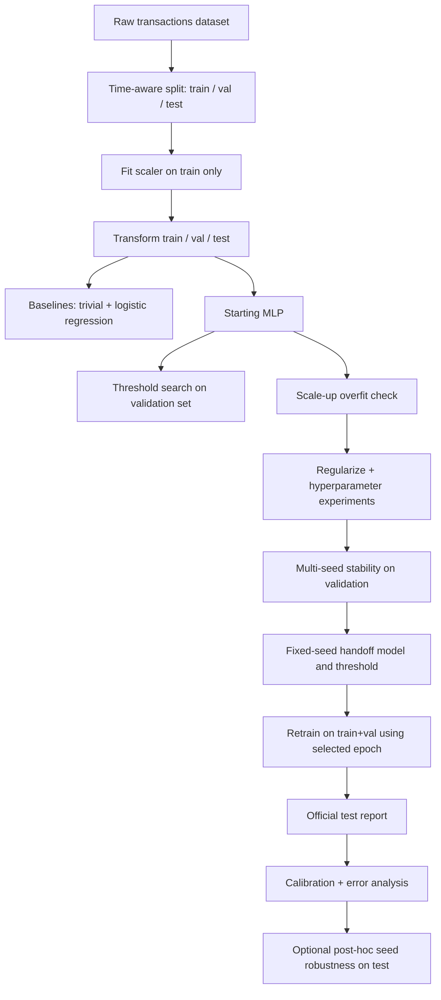
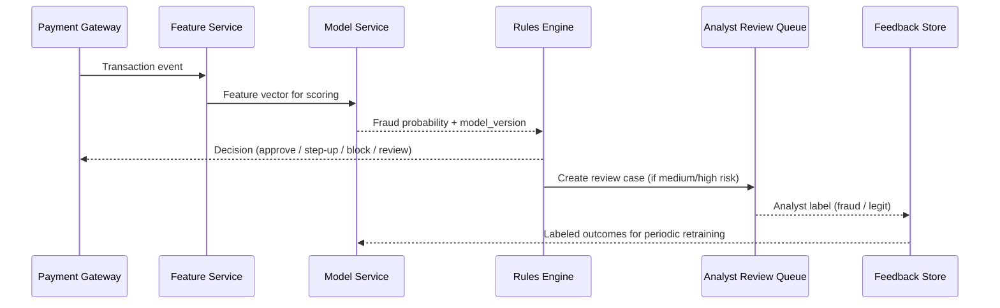
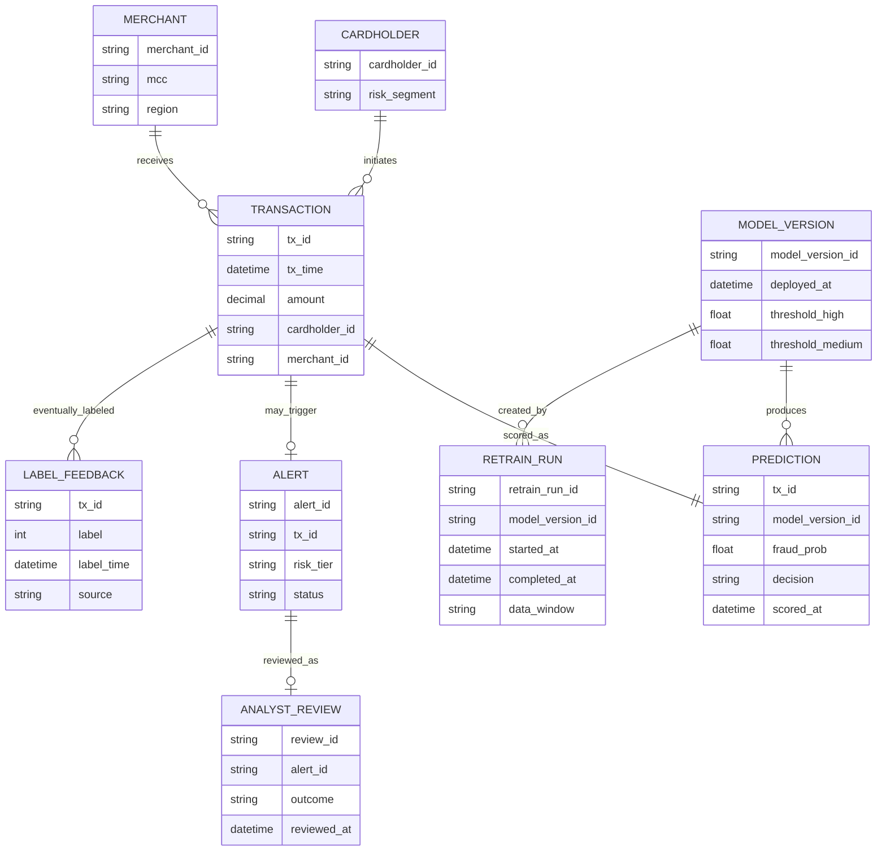

# Fraud Detection Project - Technical Design Notes

## 1) Purpose

This document adds implementation-focused technical structure to the notebook workflow.
It is intended to make future changes safer, faster, and easier to review.

## 2) When ER diagrams are appropriate here

- **Not appropriate for the current source dataset itself**:
  - the training file is a single anonymized tabular dataset (PCA features V1-V28 + Time + Amount + Class),
  - there is no normalized relational schema in the project repository.
- **Appropriate for production design**:
  - a conceptual ER model is useful for fraud operations systems (transactions, predictions, alerts, analyst feedback, retraining metadata).

So, this doc includes a **conceptual production ER diagram**, not a physical schema claim about the current CSV.

---

## 3) Offline training/evaluation pipeline (implemented in notebook)

### Protocol guardrails

1. Validation is used for threshold/hyperparameter decisions.
2. Test is not used for selection.
3. Optional multi-seed test robustness is post-hoc sensitivity analysis only.

---

## 4) Real-time serving flow (deployment-oriented)

---

## 5) Conceptual production ER diagram (optional, but appropriate)

---

## 6) Data contracts (minimal)

### Scoring input contract

| Field | Type | Notes |
|---|---|---|
| tx_id | string | Unique transaction identifier |
| tx_time | datetime | Event time for windowing and drift checks |
| features | vector<float> | Aligned with model training feature order |
| model_version_id | string | Explicit version pinning |

### Scoring output contract

| Field | Type | Notes |
|---|---|---|
| tx_id | string | Echo input key |
| fraud_prob | float | 0..1 |
| decision | enum | approve / step_up / review / block |
| threshold_snapshot | object | Thresholds used at score time |
| scored_at | datetime | Auditability |

---

## 7) Monitoring and retraining triggers

Track at minimum:

- Precision, recall, PR AUC by rolling window
- Alert volume and analyst acceptance rate
- Probability distribution shift (PSI/KL or similar)
- Data freshness and feature null-rate checks

Trigger retraining when:

1. PR AUC or recall drops below agreed floor for N windows, or
2. Distribution shift exceeds threshold, or
3. Business policy/threshold updates require recalibration.

---

## 8) How this document should be used

- Keep notebook narrative for pedagogy.
- Keep this file for system-level architecture, contracts, and operations.
- Update this file whenever threshold policy, retraining protocol, or deployment assumptions change.

